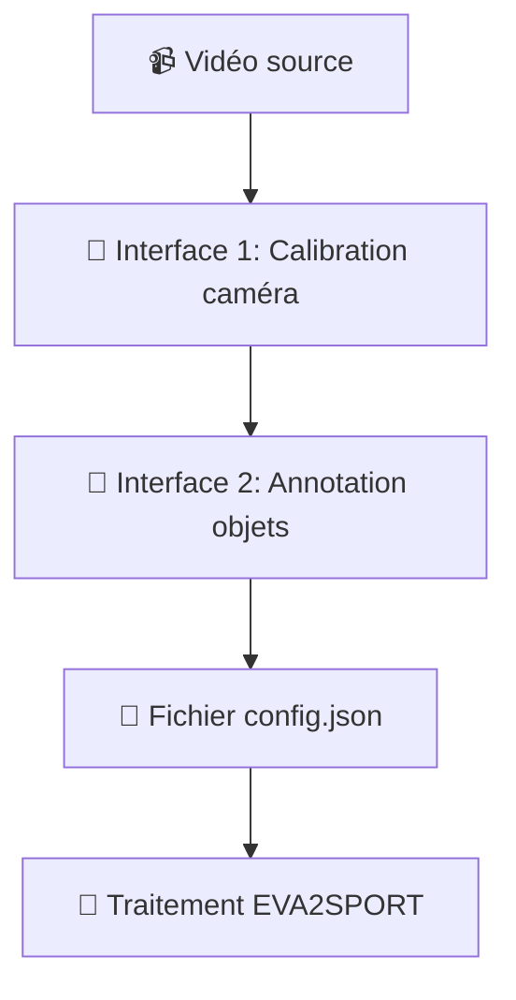

# 📁 Configuration des Données - EVA2SPORT

Ce guide explique comment préparer vos vidéos et créer les fichiers de configuration nécessaires pour EVA2SPORT.

## 🎯 Vue d'ensemble du processus

EVA2SPORT utilise un **fichier de configuration JSON** qui définit tous les paramètres nécessaires pour la segmentation. Ce fichier est créé grâce à **2 interfaces extérieures** qui simplifient le processus.

### 🔄 Workflow complet



## 📋 Structure des fichiers requis

Pour chaque vidéo, vous devez avoir :

```
data/videos/
├── nom_video.mp4                 # 🎬 Votre vidéo source
├── nom_video_config.json         # ⚙️ Fichier de configuration (généré)
└── outputs/                      # 📁 Dossier de sortie (créé automatiquement)
    └── nom_video/
        ├── frames/               # 🖼️ Images extraites
        ├── nom_video_project.json # 📊 Résultats complets
        └── nom_video_annotated.mp4 # 🎥 Vidéo annotée
```

## 🛠️ Étape 1 : Interface de Calibration Caméra

### 📷 Objectif
Définir les paramètres intrinsèques et extrinsèques de la caméra pour permettre une analyse géométrique précise.

### 🎯 Utilisation
1. **Lancez l'interface 1** : <https://2nzi-footballfieldcalibaration.hf.space/>
2. **Chargez votre vidéo** : Sélectionnez votre fichier `.mp4`
3. 
a- mode automatique
b- mode manuel

4. **Exportez la configuration** : Téléchargez la première partie du config JSON

### 📄 Données générées
```json
{
  "calibration": {
    [TODO: EXEMPLE STRUCTURE]
  }
}
```

## 👥 Étape 2 : Interface d'Annotation des Objets

### 🎯 Objectif
Définir les objets à tracker (joueurs, ballon, arbitres) et leurs positions initiales.

### 🛠️ Utilisation
1. **Lancez l'interface 2** : <https://2nzi-pointtrackapp.hf.space/>
2. **Chargez votre vidéo + config partiel** de l'étape 1
3. **Définissez les objets** :
   - **Joueurs** : Équipes, couleurs maillots, numéros
   - **Ballon** : Position initiale
   - **Arbitres/Staff** : Si nécessaire
4. **Annotez la première frame** :
   - Cliquez sur chaque objet pour le localiser
   - Ajustez les boîtes englobantes
5. **Exportez la configuration complète**

### 📄 Données générées
```json
{
  "objects": [
    [TODO: EXEMPLE STRUCTURE]
  ],
  "initial_annotations": [
    [TODO: EXEMPLE STRUCTURE]
  ]
}
```

## ✅ Étape 3 : Fusion des fichiers config en un seul nom_video_config.json

## 📊 Exemple de Configuration Complète

```json
{
  "calibration": {
    ...
  },
  "objects": [
    ...
  ],
  "initial_annotations": [
    ...
  ]
}
```

## 🚀 Prochaines étapes

Une fois votre configuration prête :

1. **📝 Mode Notebook Local** : [Guide notebook](../notebook/README.md)
2. **☁️ Mode Google Colab** : [Guide Colab](../notebook/README.md#google-colab)
3. **⚙️ Mode Pipeline Python** : [En développement]


## ⚠️ Limites Actuelles

### 🔧 Contraintes Techniques
- **🖼️ Tracking limité** : Une seule image en entrée pour le tracking pour le moment
- **⏱️ Processus fragmenté** : Processus long et non centralisé d'où la volonté de faire une pipeline orientée objet

### 🚀 Développements Futurs
- **🔄 Pipeline unifiée** : Mode Pipeline Python en développement pour centraliser le processus
- **📈 Tracking multi-frames** : Amélioration du suivi temporel des objets

---
