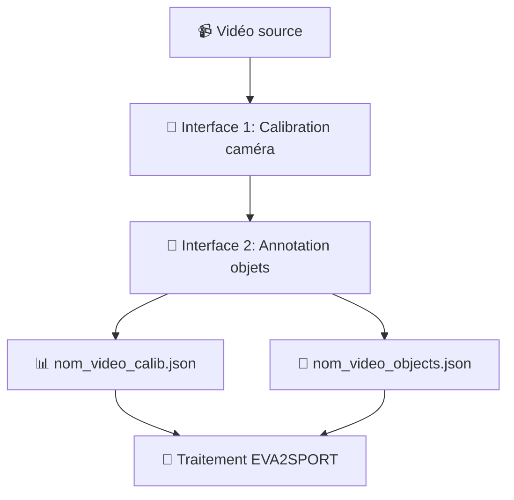

# 📁 Configuration des Données - EVA2SPORT

Ce guide explique comment préparer vos vidéos et créer les fichiers de configuration nécessaires pour EVA2SPORT.

## 🎯 Vue d'ensemble du processus

EVA2SPORT utilise maintenant **2 fichiers de configuration JSON** séparés qui définissent tous les paramètres nécessaires pour la segmentation. Ces fichiers sont créés grâce à **2 interfaces extérieures** qui simplifient le processus.

### 🔄 Workflow complet



## 📋 Structure des fichiers requis

Pour chaque vidéo, vous devez avoir :

```
data/videos/
├── nom_video.mp4                 # 🎬 Votre vidéo source
├── nom_video_calib.json          # 📊 Configuration caméra (nouveau)
├── nom_video_objects.json        # 🎯 Annotations objets (nouveau)
├── Timeline_g_SD.csv             # 📋 Événements (optionnel, pour multi-événements)
└── outputs/                      # 📁 Dossier de sortie (créé automatiquement)
    └── nom_video/
        ├── frames/               # 🖼️ Images extraites
        ├── nom_video_project.json # 📊 Résultats complets
        └── nom_video_annotated.mp4 # 🎥 Vidéo annotée
```

### 📄 **Ancien système (déprécié)**

```
❌ nom_video_config.json          # Ancien fichier unique (ne plus utiliser)
```

## 🛠️ Étape 1 : Interface de Calibration Caméra

### 📷 Objectif
Définir les paramètres intrinsèques et extrinsèques de la caméra pour permettre une analyse géométrique précise.

### 🎯 Utilisation
1. **Lancez l'interface 1** : <https://2nzi-footballfieldcalibaration.hf.space/>
2. **Chargez votre vidéo** : Sélectionnez votre fichier `.mp4`
3. **Configurez la calibration** :
   - Mode automatique (recommandé)
   - Mode manuel (si nécessaire)
4. **Exportez la configuration** : Téléchargez `nom_video_calib.json`

### 📄 Données générées - nom_video_calib.json
```json
{
  "calibration": {
    [...]
  }
}
```

## 👥 Étape 2 : Interface d'Annotation des Objets

### 🎯 Objectif
Définir les objets à tracker (joueurs, ballon, arbitres) et leurs positions initiales.

### 🛠️ Utilisation
1. **Lancez l'interface 2** : <https://2nzi-pointtrackapp.hf.space/>
2. **Chargez votre vidéo** de l'étape 1
3. **Définissez les objets** :
   - **Joueurs** : Équipes, couleurs maillots, numéros
   - **Ballon** : Position initiale
   - **Arbitres/Staff** : Si nécessaire
4. **Annotez la première frame** :
   - Cliquez sur chaque objet pour le localiser
   - Ajustez les boîtes englobantes
5. **Exportez la configuration** : Téléchargez `nom_video_objects.json`

### 📄 Données générées - nom_video_objects.json
```json
{
  "objects": [
    [...]
  ],
  "initial_annotations": [
    [...]
  ]
}
```

## 🚀 Utilisation après configuration

Une fois vos 2 fichiers de configuration prêts, vous avez plusieurs options :

### 🌐 **Option 1 : Google Colab (recommandé si GPU peu puissant)**

**Notebook principal** : `SAM_EVA2PERF_COLAB.ipynb`
- ✅ Installation automatique de la librairie eva2sport
- ✅ Interface simplifiée
- ✅ GPU gratuit
- ✅ Prêt à l'emploi

```python
# Configuration ultra-simple dans Colab
VIDEO_NAME = "SD_13_06_2025_cam1"  # Nom de base de votre vidéo
WORKING_DIR = "/content"

# Les fichiers sont automatiquement détectés :
# - SD_13_06_2025_cam1.mp4
# - SD_13_06_2025_cam1_calib.json  
# - SD_13_06_2025_cam1_objects.json
```

### 💻 **Option 2 : Pipeline Python locale**

**Scripts recommandés** :
- `examples/event_processing.py` - Script principal
- `tests/test_full_pipeline.py` - Tests complets  
- `tests/test_multi_event_manager.py` - Multi-événements

### 📔 **Option 3 : Notebooks locaux (ancien système)**

**Notebooks disponibles** (pour utilisateurs avancés) :
- `SAM_inference.ipynb` - Traitement principal SAM2
- `SAM_viz.ipynb` - Visualisation des résultats
- `SAM_inference_segment.ipynb` - Segmentation vidéo avancée

> ⚠️ **Note** : Les notebooks locaux utilisent l'ancien système et sont plus complexes à configurer. Préférez Google Colab ou la pipeline Python.


## 📊 Cas d'usage : Multi-événements avec CSV

### 📋 **Fichier Timeline CSV**

Pour traiter plusieurs événements d'une même vidéo, ajoutez un fichier CSV :

```csv
Start time,End time,Row,Description
959,964,PdB_1,Action 1
1029,1034,PdB_2,Action 2
1101,1106,PdB_2,Action 3
```

### 🚀 **Traitement automatique**

```python
# Dans SAM_EVA2PERF_COLAB.ipynb
CSV_FILE = "Timeline_g_SD.csv"
timestamp_column = 'Start time'
filter_column = 'Row'
filter_value = 'PdB'

# Le système traite automatiquement tous les événements filtrés
```

## 🔧 Troubleshooting

### 🚨 **Erreurs courantes**

| Erreur | Solution |
|--------|----------|
| `FileNotFoundError: _calib.json` | ✅ Vérifiez que `nom_video_calib.json` existe |
| `FileNotFoundError: _objects.json` | ✅ Vérifiez que `nom_video_objects.json` existe |
| `Invalid calibration format` | 📊 Utilisez l'interface de calibration pour générer le fichier |
| `Empty objects list` | 🎯 Utilisez l'interface d'annotation pour définir des objets |
| `Module 'eva2sport' not found` | 📦 Utilisez Google Colab avec SAM_EVA2PERF_COLAB.ipynb |


## 🚀 Prochaines étapes

1. **🌐 Commencez** avec [Google Colab](../notebook/SAM_EVA2PERF_COLAB.ipynb)
2. **💻 Usage avancé** : [Pipeline Python](../examples/)
3. **📚 Documentation** : [Guide des notebooks](../notebook/README.md)

## ⚠️ Évolutions récentes

### ✅ **Améliorations**
- **📊 Configuration séparée** : Plus de flexibilité et clarté
- **🌐 Librairie eva2sport** : Installation simplifiée sur Colab
- **🎯 Multi-événements** : Traitement en lot depuis CSV
- **⚡ Performance** : Pipeline optimisée

### 🔧 **Limitations actuelles**
- **🖼️ Tracking limité** : Une seule image de référence pour l'instant
- **⏱️ Processus fragmenté** : Interfaces séparées (amélioration en cours)

### 🚀 **Développements futurs**
- **🔄 Pipeline unifiée** : Interface unique pour tout le processus
- **📈 Tracking multi-frames** : Amélioration du suivi temporel
- **🎯 Détection automatique** : Moins d'annotations manuelles

---
